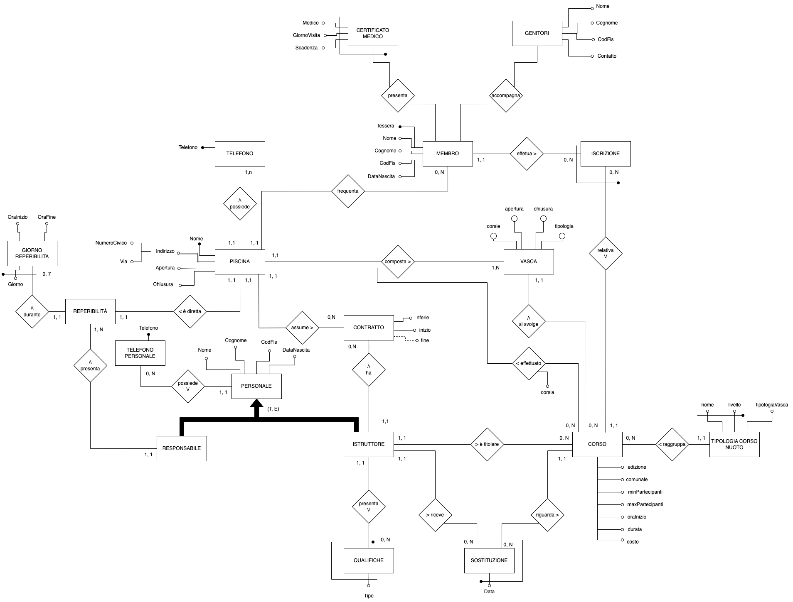

# Piscine Comunali

Progetto universitario per il corso di Basi di Dati e Web.

Scopo di questo progetto è la realizzazione di una versione semplificata per la gestione di piscine comunali, realizzando un applicativo in PHP.

La specifica completa del progetto può essere vista [qui](./Schemi/progettolab2022-2023.pdf), mentre il report finale [qui](./Schemi/documentazione_progetto.pdf).

Schema ER della base di dati:

## Requirements for running locally

- PHP 7.4.33
- PostgreSQL v15
